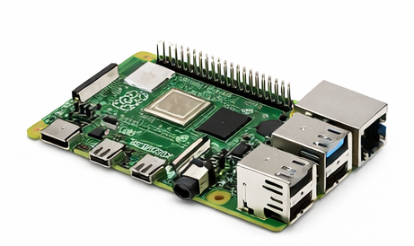
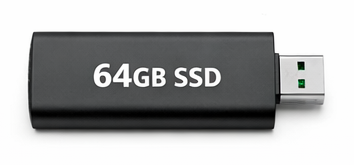
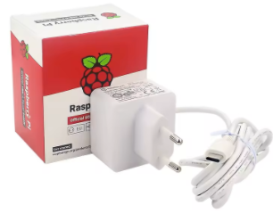
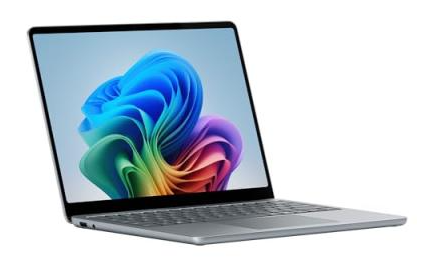
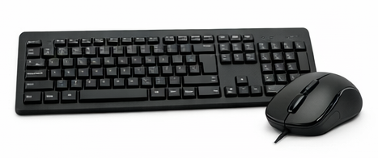
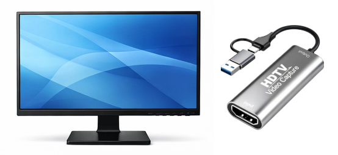
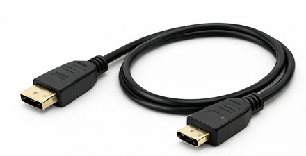
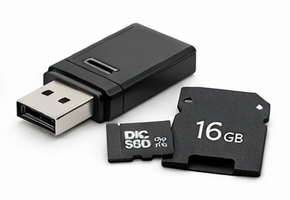

# 🏠 Installation du serveur Home Assistant

Ce document présente le matériel nécessaire pour installer et configurer un serveur Home Assistant autonome, ainsi qu’une galerie d’aperçu des composants.

## 📺 Vidéo

Lien Youtube: [https://www.youtube.com/watch?v=PQOpOTrsC44](https://www.youtube.com/watch?v=PQOpOTrsC44)

## 🔧 Matériel indispensable pour le serveur Home Assistant

1. Raspberry Pi 4 (4 Go minimum)
    * Configuration minimale recommandée. 
    * Pour de meilleures performances, vous pouvez opter pour un Raspberry Pi 4 en version 8 Go ou un Raspberry Pi 5.

    

2. Disque SSD USB (32 Go minimum)
    * Un SSD USB est recommandé pour la stabilité.
    * Une clé USB ou une carte micro‑SD peut fonctionner, mais la carte SD est déconseillée pour un usage prolongé.
    * Privilégiez une capacité de 64 Go ou 128 Go

    

3. Alimentation USB‑C
    * Raspberry Pi 4 : 5V / 3A
    * Raspberry Pi 5 : 5V / 5A

    

## 🖥️ Matériel pour la configuration initiale

Ce matériel n’est nécessaire que pour l’installation initiale du système.

1. Un ordinateur (Windows dans ce didacticiel)

2. Clavier + souris USB

3. Un écran d’ordinateur (ou une carte d’acquisition)

4. Câble HDMI → micro‑HDMI
    * Nécessaire pour connecter le Raspberry Pi à un écran ou une carte d’acquisition. 
    * Alternative: Câble HDMI + adaptateur micro‑HDMI → HDMI

    

5. Lecteur de carte micro‑SD
    * Uniquement si vous installez Home Assistant via une carte micro‑SD. 

    

## 📦 Résumé rapide

* Serveur autonome : Raspberry Pi + SSD + alimentation

* Installation initiale : ordinateur, écran, clavier/souris, câble HDMI, lecteur SD

Ce matériel constitue la base pour suivre le didacticiel d’installation de Home Assistant en toute autonomie.