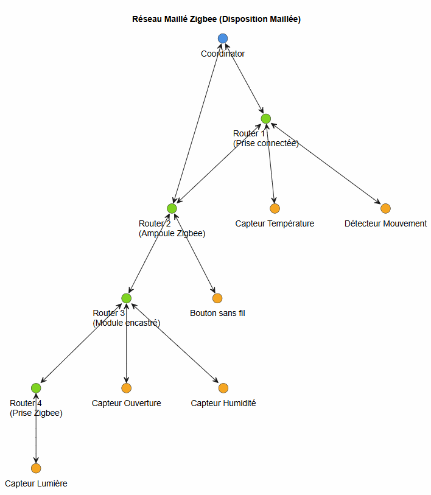
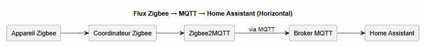
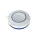
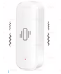

# 🌐 Comprendre Zigbee, son fonctionnement, et son intégration avec Home Assistant

## 📺 Vidéo

Lien Youtube: [https://www.youtube.com/watch?v=FXeYa6ULJT4](https://www.youtube.com/watch?v=FXeYa6ULJT4)

## 📌 Qu’est‑ce que Zigbee ?
Zigbee est un **protocole de communication sans fil basse consommation**, conçu pour les objets connectés (IoT).  
Il est particulièrement utilisé dans la domotique pour connecter :

- capteurs (température, mouvement, ouverture…)
- ampoules
- prises connectées
- interrupteurs
- actionneurs divers

Zigbee fonctionne dans la bande **2.4 GHz**, comme le Wi‑Fi, mais avec une portée plus faible et une consommation beaucoup plus réduite.

---

## 🧩 Architecture Zigbee : Coordinator, Router, End Device

| Rôle | Description | Fait relais ? |
|------|-------------|---------------|
| **Coordinator** | Le “cerveau” du réseau Zigbee. Un seul par réseau. Il crée et gère le réseau. | ✔️ Oui |
| **Router** | Appareils alimentés en permanence (prises, ampoules, modules). Ils étendent le réseau. | ✔️ Oui |
| **End Device** | Appareils sur batterie (capteurs). Ils dorment la plupart du temps. | ❌ Non |

---

## 🔗 Le maillage Zigbee (Mesh Network)

Zigbee utilise un **réseau maillé** :  
les appareils **Router** servent de relais pour transmettre les messages.

### Avantages du maillage :
- meilleure portée globale
- réseau plus stable
- redondance : si un routeur tombe, le réseau peut se réorganiser
- moins de dépendance au coordinateur pour la portée

---

## 📡 Schéma : comment les appareils communiquent

Voici un schéma simple montrant un réseau Zigbee typique :

---

## 🏠 Zigbee et Home Assistant

Home Assistant ne parle pas Zigbee nativement.  
Il a besoin d’un **coordinateur Zigbee**, souvent via :

- **ZHA** (Zigbee Home Automation) → intégré à Home Assistant  
- **Zigbee2MQTT** → nécessite MQTT

### 1. 🔧 ZHA
- Simple à configurer  
- Compatible avec de nombreux dongles  
- Pas besoin de MQTT  
- Interface intégrée dans Home Assistant  

### 2. 🔧 Zigbee2MQTT
- Très flexible  
- Compatible avec énormément d’appareils  
- Nécessite un broker MQTT  
- Interface dédiée (frontend Zigbee2MQTT)

---

## 📨 Rôle de MQTT dans Zigbee2MQTT

MQTT est un **protocole de messagerie léger** utilisé pour transporter les données entre :

- Zigbee2MQTT  
- Home Assistant  

### Fonctionnement simplifié :

MQTT agit comme un **bus de messages**.  
Home Assistant s’abonne aux topics MQTT pour recevoir les données des capteurs et envoyer des commandes.

---

## 🧠 Résumé

- Zigbee = protocole domotique basse consommation basé sur un réseau maillé.  
- Coordinator = point central, un seul par réseau.  
- Router = appareils alimentés, servent de relais.  
- End Device = capteurs sur batterie, ne relaient pas.  
- Home Assistant peut utiliser **ZHA** ou **Zigbee2MQTT**.  
- Zigbee2MQTT nécessite un **broker MQTT** pour communiquer avec Home Assistant.

---

## 📚 Ressources utiles

- https://www.zigbee2mqtt.io  
- https://www.home-assistant.io/integrations/zha  
- https://www.home-assistant.io/integrations/mqtt  

# 🛠️ Installation de Zigbee2MQTT avec Home Assistant

Dans le didacticielle nous utiliserons Zigbee2MQTT.
Cette section décrit le matériel nécessaire pour démarrer.

📦 Matériel nécessaire

### 1. Un coordinateur Zigbee
Pour ce guide, nous utiliserons :

👉 Sonoff Zigbee 3.0 USB Dongle Plus (ZBDongle‑P)  
C’est un coordinateur très fiable, compatible Zigbee2MQTT et Home Assistant.

### 2. Des périphériques Zigbee

Selon vos besoins :
* capteurs de température
* capteurs d’ouverture
* boutons Zigbee
* capteurs de vibration
* ampoules Zigbee
* prises connectées (qui servent aussi de routeurs)

Pour ce didacticiel, nous utiliserons :
* un bouton Zigbee

* un capteur de vibration Zigbee

Vérifiez la compatibilité des appareils, Zigbee2MQTT maintient une liste très complète des appareils compatibles :

👉 https://www.zigbee2mqtt.io/supported-devices/

Avant d’acheter un périphérique, il est recommandé de vérifier qu’il apparaît dans cette liste.