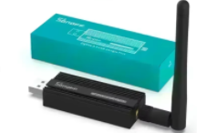

# 🏠 Installation de Mosquitto MQTT + Zigbee2MQTT via l’interface Home Assistant

Ce guide explique comment installer Mosquitto MQTT et Zigbee2MQTT depuis l’interface Home Assistant, les configurer, puis appairer un bouton Zigbee.

# 📺 Vidéo

Lien Youtube: [https://www.youtube.com/@Baronnix/playlists](https://www.youtube.com/@Baronnix/playlists)

# 📦 Prérequis

* Home Assistant

* Accès à l’interface Home Assistant

* Des appareils Zigbee (boutons, ampoules, capteurs, ...)

* Un dongle Zigbee compatible (Sonoff ZBDongle‑P/E, ConBee II, CC2652…)



# Installer Mosquitto MQTT via Home Assistant

## 1. 📥 Installation

1. Aller dans Paramètres → Modules complémentaires

2. Cliquer sur Boutique des modules complémentaires

3. Rechercher Mosquitto broker

4. Cliquer sur Installer

## 2. ⚙️ Configuration

1. Ouvrir le module Mosquitto

2. Aller dans Configuration

3. Laisser la configuration par défaut (Home Assistant gère automatiquement les utilisateurs)

4. Activer :

    * Démarrer au démarrage

    * Surveiller

5. Cliquer sur Démarrer

## 3. 👤 Utilisateur MQTT

Home Assistant utilise ses propres utilisateurs.

Créer un utilisateur dédié :

1. Aller dans Paramètres → Personnes & Utilisateurs → Utilisateurs

2. Ajouter un utilisateur :

    * Nom : mqtt

    * Mot de passe : (à choisir)

    * Ne pas cocher "Administrateur"

# Installer Zigbee2MQTT via Home Assistant

## 1. 📥 Installation

1. Aller dans Paramètres → Modules complémentaires

2. Cliquer sur Boutique des modules complémentaires

3. Rechercher Zigbee2MQTT (dépôt officiel ou dépôt de Daniel Welch si nécessaire)

4. Cliquer sur Installer

## 2.🔌 Sélection du dongle Zigbee

1. Ouvrir le module Zigbee2MQTT

2. Aller dans Configuration

3. Dans Serial, sélectionner :

* ttyUSB0, ttyACM0 ou ttyAMA0 selon votre dongle

* Ou utiliser le chemin stable /dev/serial/by-id/...

## 3. ⚙️ Configuration MQTT

Dans la configuration du module :

```yaml
mqtt:
  base_topic: zigbee2mqtt
  server: mqtt://core-mosquitto:1883
  user: mqtt
  password: VOTRE_MOT_DE_PASSE
homeassistant: true
frontend:
  port: 8099
```

## 4. ▶️ Lancer Zigbee2MQTT

1. Activer :

    * Démarrer au démarrage

    * Surveiller

2. Cliquer sur Démarrer

3. Ouvrir l’interface Zigbee2MQTT via Ouvrir l’interface Web

# Intégration MQTT dans Home Assistant

Normalement, Home Assistant détecte automatiquement le broker MQTT.

Si ce n’est pas le cas :

1. Aller dans Paramètres → Appareils & Services

2. Cliquer sur Ajouter une intégration

3. Rechercher MQTT

4. Renseigner :

    * Hôte : core-mosquitto

    * Port : 1883

    * Identifiant : mqtt

    * Mot de passe : celui créé plus tôt

Home Assistant détectera automatiquement Zigbee2MQTT.

# Appairage d’un bouton Zigbee

## 1. 🔄 Mettre Zigbee2MQTT en mode appairage

Dans l’interface Zigbee2MQTT :

1. Aller dans Permit Join

2. Activer "Allow new devices to join"  
(ou cliquer sur le bouton Permit Join)

## 2. 🔘 Mettre le bouton en mode appairage

Selon le modèle, généralement :

* Appuyer longuement 5–10 secondes sur le bouton reset

* Une LED clignote → l’appareil cherche le réseau Zigbee

## 3. 🟢 Appareil détecté

Dans Zigbee2MQTT, un nouvel appareil apparaît :

* Nom : 0x00158d000xxxxx

* Type : Wireless switch, Button, etc.

Vous pouvez :

* Renommer l’appareil

* Vérifier les actions (single click, double click, long press…)

* Le retrouver automatiquement dans Home Assistant

# Utiliser le bouton dans Home Assistant

## 1. 🧩 Automatisations

1. Aller dans Paramètres → Automatisations & Scènes

2. Créer une nouvelle automatisation

3. Déclencheur :

    * Appareil

    * Choisir votre bouton Zigbee

    * Sélectionner l’action (ex : single click)

4. Ajouter une action (ex : allumer une lumière)