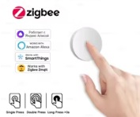
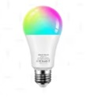

# 🧩 Buzzer de salon en Zigbee avec Home Assistant

Ce guide explique comment créer un système de buzzers Zigbee dans Home Assistant, utilisant 2 boutons Zigbee et 1 ampoule Zigbee comme indicateur lumineux.

# 📺 Vidéo

Lien Youtube: [https://www.youtube.com/@Baronnix/playlists](https://www.youtube.com/@Baronnix/playlists)

# 🎯 Objectif

Créer un système où :
* Chaque bouton Zigbee agit comme un buzzer.
* L’ampoule Zigbee sert de signal visuel (ex : rouge pour le joueur 1, bleu pour le joueur 2).
* Home Assistant gère la logique (premier à appuyer, reset, etc.).

# 🧩 Matériel nécessaire

* Home Assistant avec une passerelle Zigbee
* Accès à l’interface Home Assistant
* Une passerelle Zigbee configurée avec Home Assistant (Zigbee2MQTT) (Voir tutoriel 04 - Zigbee Installation et Utilisation)
* 2 boutons Zigbee identiques (éviter 2 boutons de types différents car les temps de réponses peuvent grandement varier et fausser le jeu)

  

* 1 ampoule Zigbee RGB

  

# 🛠️ 1. Appairer les appareils Zigbee

1. Ouvre Zigbee2MQTT dans Home Assistant.
2. Autoriser l'appairage
3. Mets ton bouton Zigbee en mode appairage.

Répète pour le second bouton et l’ampoule.

Tu devrais voir apparaître trois nouveaux appareils.

# 🎛️ 2. Nommer clairement les appareils

Dans Zigbee2MQTT renomme les appareils :
* Bouton 1 → bouton_joueur_1
* Bouton 2 → bouton_joueur_2
* Ampoule → lampe_buzzer

Cela simplifie les automatisations.

# 🎨 3. Création des input_select pour les couleurs

On crée deux sélecteurs : un pour le joueur 1, un pour le joueur 2.
1. Ouvre l'éditeur de configuration de ton choix (ex: Studio Code Server)
2. Ajoute les 2 input_select suivants:

```yaml
input_select:
  couleur_joueur_1:
    name: Couleur Joueur 1
    options:
      - dodgerblue
      - fuchsia
      - turquoise
      - red
      - salmon
      - gold
      - yellow
      - springgreen
      - seagreen
      - pink
      - plum
      - sandybrown
      - purple
      - orchid
      - orange
      - magenta
      - lime
      - hotpink
    initial: dodgerblue
    icon: mdi:palette
  couleur_joueur_2:
    name: Couleur Joueur 2
    options:
      - dodgerblue
      - fuchsia
      - turquoise
      - red
      - salmon
      - gold
      - yellow
      - springgreen
      - seagreen
      - pink
      - plum
      - sandybrown
      - purple
      - orchid
      - orange
      - magenta
      - lime
      - hotpink
    initial: hotpink
    icon: mdi:palette
```
3. Ouvre Paramètres → Outils de développement dans Home Assistant.
4. Vérifier la configuration
5. Si la configuration est valide, Redémarrer avec un rechargement rapide

La liste des couleurs: [https://www.w3.org/TR/css-color-3/#svg-color](https://www.w3.org/TR/css-color-3/#svg-color)

# 🔢 4. Création de 2 input_number pour mémoriser la victoire et un compteur de réinitialisation

1. Ouvre l'éditeur de configuration de ton choix (ex: Studio Code Server)
2. Ajoute l'input_number suivant:
```yaml
input_number:
  joueur_gagnant:
    name: joueur gagnant
    initial: 0
    min: 0
    max: 2
    step: 1
    icon: mdi:trophy
  tempo_joueur_gagnant:
    name: Tempo joueur gagnant
    initial: 5
    min: 1
    max: 10
    step: 1
    icon: mdi:timer-sand
```
3. Ouvre Paramètres → Outils de développement dans Home Assistant.
4. Vérifier la configuration
5. Si la configuration est valide, Redémarrer avec un rechargement rapide

# ⚙️ 6. Créer les automatisations pour chaque bouton

Le principe :
* Quand un bouton est pressé, si il y a un joueur gagnant,on ignore (donc seul le premier appui compte).
* Quand un bouton est pressé, si il n'y a pas de joueur gagnant, alors le joueur est déclaré gagnant et les actions suivantes sont realisées:
    1. Définir la variable "joueur gagnant" à la valeur du joueur
    2. Allumer l'ampoule de la couleur du joueur gagnant
    3. Attendre le nombre de seconde définit sur "Tempo joueur gagnant" 
    4. Définir la variable "joueur gagnant" à la valeur 0
    5. Remettre la lumière dans l'état normale (lumière naturelle)

🔵 Automatisation pour le Joueur 1

```yaml
alias: Buzzer Joueur 1
description: ""
triggers:
  - domain: mqtt
    device_id: 8cdfe9e99a8e42c1b8e69414a201cf66
    type: action
    subtype: single
    metadata: {}
    trigger: device
conditions:
  - condition: numeric_state
    entity_id: input_number.joueur_gagnant
    below: 1
actions:
  - action: input_number.set_value
    metadata: {}
    target:
      entity_id: input_number.joueur_gagnant
    data:
      value: 1
  - action: light.turn_on
    metadata: {}
    target:
      entity_id: light.lampe_buzzer
    data:
      color_name: "{{ states('input_select.couleur_joueur_1') }}"
      brightness_pct: 100
  - delay:
      hours: 0
      minutes: 0
      seconds: "{{ states('input_number.tempo_joueur_gagnant') }}"
      milliseconds: 0
  - action: input_number.set_value
    metadata: {}
    target:
      entity_id: input_number.joueur_gagnant
    data:
      value: 0
  - action: light.turn_on
    metadata: {}
    target:
      entity_id: light.lampe_buzzer
    data:
      brightness_pct: 100
      color_temp_kelvin: 2700
mode: single
```

🔴 Automatisation pour le Joueur 2
```yaml
alias: Buzzer Joueur 2
description: ""
triggers:
  - domain: mqtt
    device_id: c889dbd51df213df3aae9f45a9130197
    type: action
    subtype: single
    trigger: device
conditions:
  - condition: numeric_state
    entity_id: input_number.joueur_gagnant
    below: 1
actions:
  - action: input_number.set_value
    metadata: {}
    target:
      entity_id: input_number.joueur_gagnant
    data:
      value: 2
  - action: light.turn_on
    metadata: {}
    target:
      entity_id: light.lampe_buzzer
    data:
      color_name: "{{ states('input_select.couleur_joueur_2') }}"
      brightness_pct: 100
  - delay:
      hours: 0
      minutes: 0
      seconds: "{{ states('input_number.tempo_joueur_gagnant') }}"
      milliseconds: 0
  - action: input_number.set_value
    metadata: {}
    target:
      entity_id: input_number.joueur_gagnant
    data:
      value: 0
  - action: light.turn_on
    metadata: {}
    target:
      entity_id: light.lampe_buzzer
    data:
      brightness_pct: 100
      color_temp_kelvin: 2700
mode: single
```

# 🔄 7. Ajouter un bouton “Reset”

On va créer un bouton pour remettre a zéro en cas de besoin.
On peut:
* utiliser un troisième bouton Zigbee, ou
* créer un bouton virtuel dans Home Assistant

Pour ajouter un bouton virtuel
* Aller dans Configuration → Appareils et services → Entrées
* Créer une entrée
* Choisir Bouton (input_button)
* Lui donner un nom, par ex. Reset Buzzer
* Enregistrer

Pour cela on va créer une automatisation qui, lorsqu'elle est déclenchée va:
1. Définir la variable "joueur gagnant" à la valeur 0
2. Remettre la lumière dans l'état normale (lumière naturelle)

```yaml
alias: Reset Buzzer
description: ""
triggers:
  - trigger: state
    entity_id:
      - input_button.reset_buzzer
conditions: []
actions:
  - action: input_number.set_value
    metadata: {}
    target:
      entity_id: input_number.joueur_gagnant
    data:
      value: 0
  - action: light.turn_on
    metadata: {}
    target:
      entity_id: light.lampe_buzzer
    data:
      brightness_pct: 100
      color_temp_kelvin: 2700
mode: single

```

# 🖼️ 8. Aperçu visuel du tableau de bord

On va créer un tableau de bord pour le jeu.
1. Dans ton tableau de bord principal
2. Passe en mode "Modfier le tableau de bord"
3. Ajoute une vue de type "Maconnerie"
4. Créé la vue souhaitée en insérant
     * Le bouton "Reset"
     * Les sélecteurs de couleurs des 2 joueurs
     * La variable "Joueur gagnant"
     * La variable ""Tempo joueur gagnant" "

```yaml
type: entities
entities:
  - entity: input_number.joueur_gagnant
  - entity: light.lampe_buzzer
  - entity: input_number.tempo_joueur_gagnant
  - entity: input_select.couleur_joueur_1
  - entity: input_select.couleur_joueur_2
  - entity: input_button.reset_buzzer
```

# 🧪 9. Tester le système

1. Appuie sur le bouton “Reset”
2. Appuie sur un des deux boutons.
3. Vérifie que
    * La lampe s’allume dans la couleur du joueur
    * La variable "joueur gagnant" est définie à la valeur du joueur
    * La lampe s’éteint après le nombre de seconde définit sur "Tempo joueur gagnant" 
    * La variable "joueur gagnant" repasse à 0 après le nombre de seconde définit sur "Tempo joueur gagnant" 
4. Recommence l'opération avec le second bouton
5. Recommence l'opération avec l'un des 2 boutons et avant la fin du nombre de seconde définit sur "Tempo joueur gagnant", appui sur le bouton “Reset” et vérifie que
    * La lampe s’éteint après le nombre de seconde définit sur "Tempo joueur gagnant" 
    * La variable "joueur gagnant" repasse à 0 après le nombre de seconde définit sur "Tempo joueur gagnant" 

Le jeu peut recommencer.
