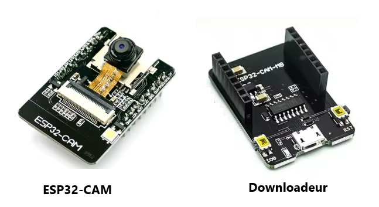

# 📘 Tutoriel : Intégrer une caméra ESP dans Home Assistant avec ESPHome Builder, ESPHome et HACS

Ce guide explique comment :
 * Installer HACS dans Home Assistant
 * Installer ESPHome
 * Programmer un ESP32-CAM (ou autre module caméra compatible) via ESPHome Builder
 * Intégrer la caméra dans Home Assistant

# 📺 Vidéo

Lien Youtube: [https://www.youtube.com/@Baronnix/playlists](https://www.youtube.com/@Baronnix/playlists)

# 🏗️ 1. Prérequis

 * Une instance fonctionnelle de Home Assistant version 2026
 * Un ESP32-CAM et sa carte de téléchargement (downloadeur)
    
    
    
 * Un câble USB pour la programmation (flash de l'ESP). Attention, de nombreuses cartes de téléchargement ont un port micro-usb
 * Un réseau Wi-Fi 2.4 GHz
 * Un navigateur web moderne

# ⚙️ 2. Installation d’ESPHome dans Home Assistant

ESPHome permet de compiler et flasher facilement des firmwares pour ESP.

Installation
1. Ouvrez Paramètres → Apps
2. Cliquez sur Installer l'application
3. Recherchez ESPHome
4. Installez l’intégration
5. Redémarrez Home Assistant

Vous verrez ensuite un nouvel onglet ESPHome dans la barre latérale.

# 🛠️ 3. Programmer l’ESP avec ESPHome Builder

ESPHome Builder est un outil en ligne permettant de générer un firmware ESPHome en décrivant sa configration au format YAML.

Configuration de identifiants Wifi:
1. Accédez à ESPHome Builder
2. Aller dans l'onglet SECRETS
3. Renseigner les identifiants Wifi tel que:
```yaml
# Your Wi-Fi SSID and password
wifi_ssid: "Baronnix"
wifi_password: "MOTDEPASSE"
```

Configuration de l'ESP:
1. Accédez à ESPHome Builder
2. Sélectionnez votre modèle (ex : ESP32-CAM)
3. Configurez :
    * Nom du device
    * SSID et mot de passe Wi-Fi (utilisez les variables définies dans l'onglet SECRETS)
    * Options caméra (OV2640, résolution, rotation)
4. Cliquez sur Build
5. Téléchargez le firmware .bin
6. Flashez-le via :
     * ESPHome Web Flasher
     * ou un outil comme esptool.py

Une fois flashé, l’ESP redémarre et se connecte au Wi-Fi.

```yaml
# Board: AI Thinker ESP32-CAM (AI Thinker)
# Definition: definitions/boards/esp32cam/manifest.yaml

substitutions:
  devicename: esp-cam-01
  friendly_name: ESP-CAM-01

esphome:
  name: $devicename
  friendly_name: $friendly_name

esp32:
  variant: esp32
  flash_size: 4MB
  framework:
    type: arduino

logger:

api:
  encryption:
    key: "cs6NA6R7LNrDInydwpRl/OXcYnxz5agVS+bEAkz2f6U="

ota:
  - platform: esphome

wifi:
  ssid: !secret wifi_ssid
  password: !secret wifi_password
  ap:
    ssid: camera-01 Fallback Hotspot
    password: "mzvH7LMe1tGo"

captive_portal:

i2c:
  - scl: GPIO27
    sda: GPIO26
    id: i2c_1

psram:
  mode: quad
  speed: 80MHz
  
esp32_camera:
  name: $devicename
  i2c_id: i2c_1
  data_pins: [GPIO5, GPIO18, GPIO19, GPIO21, GPIO36, GPIO39, GPIO34, GPIO35]
  external_clock:
    pin: GPIO0
  href_pin: GPIO23
  pixel_clock_pin: GPIO22
  vsync_pin: GPIO25

  max_framerate: 25 fps
  idle_framerate: 0.2 fps
  resolution: 1024x768
  jpeg_quality: 10
  vertical_flip: False
  contrast: 0
  brightness: 0
  saturation: 0

esp32_camera_web_server:
  - mode: STREAM
    port: 8080
    id: esp32_camera_web_server_1
  - mode: SNAPSHOT
    port: 8081
    id: esp32_camera_web_server_2

time:
  - platform: homeassistant
    id: homeassistant_time

output:
  - platform: gpio
    pin: GPIO4
    id: gpio_4
  - platform: gpio
    pin:
      number: GPIO33
      inverted: True
    id: gpio_33

light:
  #flashlight
  - platform: binary
    output: gpio_4
    name: $friendly_name light
  - platform: binary
    output: gpio_33
    name: $friendly_name light state

sensor:
  - platform: wifi_signal
    name: $friendly_name Wifi signal
    update_interval: 10s
  - platform: uptime
    name: $friendly_name Uptime

text_sensor: 
  - platform: version
    name: $friendly_name ESPHome version
  - platform: wifi_info
    ssid: 
        name: $friendly_name ESPHome WiFi
        
switch:
  - platform: restart
    name: $friendly_name restart

```

# 🔗 4. Ajouter l’ESP dans Home Assistant

Dès que l’ESP est en ligne, Home Assistant le détecte automatiquement.

Méthode automatique:
 * Une notification apparaît : "Un nouvel appareil ESPHome a été découvert"
 * Cliquez sur Configurer
 * Validez l’intégration

Méthode manuelle:
 * Allez dans ESPHome dans la barre latérale
 * Cliquez sur + Ajouter un nœud
 * Entrez l’adresse IP de l’ESP

# 📸 5. Vérifier la caméra dans Home Assistant

Une fois l’intégration terminée :
 * Allez dans Aperçu
 * Ajoutez une carte Image ou Picture Entity
 * Sélectionnez l’entité caméra (ex : camera.esp32_cam)

Vous devriez voir le flux vidéo en direct.

# 🧪 6. Test de l'interface de l'ESP

1. Aller dans ESPHome Builder 
2. Ouvrir les journaux de l'appareil
3. Aller dans Options avancées -> Adresse IP
4. Copier l'adresse IP et la coller dasns un navigateur Web


# 🧯 7. Dépannage rapide

Pas d’image ?  

 * Vérifiez la résolution, la rotation, et l’alimentation (l’ESP32-CAM est sensible).
 * L’ESP ne se connecte pas au Wi-Fi ?  
 * Assurez-vous d’être en 2.4 GHz.

Impossible de flasher ?  
 * Maintenez le bouton BOOT pendant la connexion USB.

# 🎯 8. Conclusion

Vous avez maintenant :
 * Installé ESPHome
 * Généré un firmware via ESPHome Builder
 * Flashé un ESP32-CAM
 * Intégré la caméra dans Home Assistant

Votre système est prêt pour des automatisations, de la surveillance ou des projets avancés.